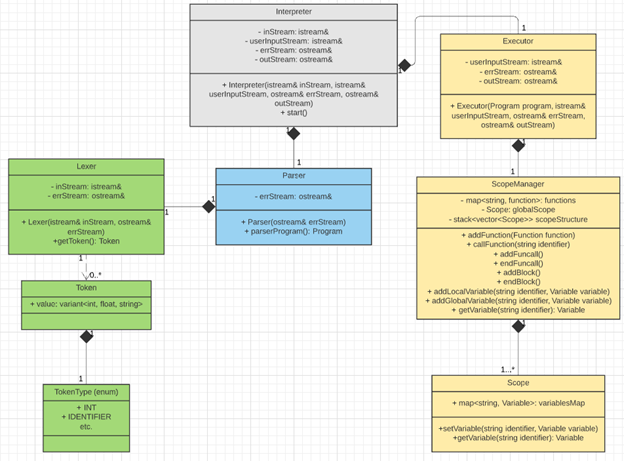
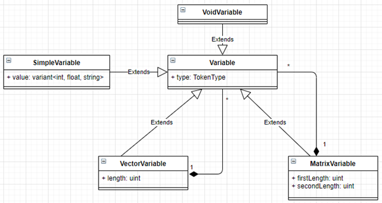

# Matrixlang

Custom language with support for vectors and matrices. The following documentation is also available in [Polish]([PL]Dokumentacja.pdf).

# Functionality

1. The main purpose of Matrixlang is to allow the programmer to use the `Matrix` type.
2. `Vector` type is also available. `Matrix` has been created as a `Vector` of `Vectors`, but this is in no way visible for the programmer.
3. The other available types are: `int`, `float` and `string`.
4. The language allows defining functions (can be recursive), creating `for` loops, and supports two conditional instructions - `switch` and `if`.
5. Matrixlang is an interpreted language, the interpreter has been written in C++.
6. The typing is strong and dynamic. All variables are mutable.
7. Each variable has a scope - it can only be modified within a given code block.

The next section consists of examples which explain in detail the above functionality.

# Examples

1. Function returning the value of n-th element in a Fibonacci sequence (recursive approach).

```
int fibonacciRec(int n) {
    if(n == 0) { return 0; }
    if(n == 1) { return 1; }
    return fibonacciRec(n - 1) + fibonacciRec(n - 2);
}

int main() {
    print(intToString(fibonacciRec(10))); #prints 55
    return 0;
}
```

2. Function returning the value of n-th element in a Fibonacci sequence (iterative approach).

```
int fibonacciIter(int n) {
    #special cases
    if(n == 0) { return 0; }
    if(n == 1) { return 1; }
    
    #declare variables
    int prevprev = 0;
    int prev = 1;
    int current;
    
    #main loop
    for(int i = 2; i < n; ++i) {
        current = prev + prevprev;
        prevprev = prev;
        prev = current;
    }
    
    return current;
}

int main() {
    print(intToString(fibonacciIter(10))); #prints 55
    return 0;
}
```

3. Function returning the biggest value in a matrix of integers.

```
int findMax(Matrix<int>[n_cols, n_rows] matrix) {
    #n_cols and n_rows always an int
    
    int max = INT_MIN; #environmental constant
    for(int i = 0; i < n_cols; ++i) {
        for(int j = 0; j < n_rows; ++j) {
            if(matrix[i, j] > max) { max = matrix[i, j]; }
        }
    }
    return max;

}

int main() {
    Matrix<int>[2, 2] matrix;
    matrix[0, 0] = -3;
    matrix[0, 1] = 3;
    matrix[1, 0] = 14;
    matrix[1, 1] = -14;
    print(intToString(findMax(matrix))); #prints 14
    return 0;
}
```

4. Function concatenating all strings in a matrix into one string.

```
string concatStringMatrix(Matrix<string>[n_cols, n_rows] matrix) {
    string concatString = “”;
    for(int i = 0; i < n_cols; ++i) {
        for(int j = 0; j < n_rows; ++j) {
            concatString += matrix[i, j];
        }
    }
    return concatString;
}

int main() {
    Matrix<string>[2, 2] matrix;
    matrix[0, 0] = “ala ”;
    matrix[0, 1] = “ma “;
    matrix[1, 0] = “kota ”;
    matrix[1, 1] = “i psa”;
    print(concatStringMatrix(matrix)); #prints “ala ma kota i psa”
    return 0;
}
```

5. Function returning the median value of elements in a vector.

```
float average(Vector<float>[n] vector) {
    float sum = 0.0;
    for(int i = 0; i < n; ++i) {
        sum += vector[i];
    }
    return sum / intToFloat(n);
}

int main() {
    Vector<float>[2] vector;
    vector[0] = 2;
    vector[1] = 3;
    print(floatToString(average(vector))); #prints 2.5
    return 0;
}
```

6. Program printing text based on user input.

```
void printAgeDescription(int age) {
    ```
    In this function a switch statement is used to print information about your age.
    ```
    switch {
    case age < 0:
        print("Your age is incorrect");
    case age < 18:
        print("You are a kid.");
    case age < 60:
        print("You are an adult.");
    default:
        print("You are a pensioner.");
    }
}

int main() {
    int age = stringToInt(input());
    printAgeDescription(age);
    return 0;
}
```

7. Program split into multiple files.

&nbsp;&nbsp;&nbsp;&nbsp;&nbsp;&nbsp;&nbsp;&nbsp;&nbsp;&nbsp;&nbsp;&nbsp;&nbsp;&nbsp;&nbsp;&nbsp;a. Contents of "<span>yearInfo</span>.ml":

```
void printYearInfo(int currentYear) {
    print(“Hello from year ” currentYear “”);
}
```

&nbsp;&nbsp;&nbsp;&nbsp;&nbsp;&nbsp;&nbsp;&nbsp;&nbsp;&nbsp;&nbsp;&nbsp;&nbsp;&nbsp;&nbsp;&nbsp;b. Contents of "<span>main</span>.ml":

```
@include “yearInfo.ml”
    int main() {
    printYearInfo(2021);
    return 0;
}
```

8. Program showing that variables are passed by value.

```
int addOne(int x) {
    x++;
    return x;
}

int main() {
    int a = 3;

    addOne(a);
    print(intToString(a)); #prints 3

    a = addOne(a);
    print(intToString(a)); #prints 4

    return 0;
}
```

9. Program showing the behaviour of copying - Vector is used as an example. Alternative form of calling `print()` function is shown as well.

```
int main() {
    Vector<int>[2] vector;
    print("0: "vector[0]", 1: "vector[1]"\n"); #prints "0: 0, 1: 0"
    vector[0] = 3;
    vector[1] = 5;

    Vector<int>[2] vectorCopy = vector;
    print("0: "vectorCopy[0]", 1: "vectorCopy[1]"\n"); #prints "0: 3, 1: 5"
    return 0;
}
```

10. Program showing that variables have scope (they are visible only within the given code block).

```
int main() {
    {
        int a = 10;
    }
    print(intToString(a));	#error - no such variable "a"
    return 0;
}
```

11. Program showing error when trying to divide by zero.

```
int main() {
    int a = 1 / 0;	#error - cannot divide by 0
    return 0;
}
```

12. Program showing strong typing.

```
int main() {
    int a = 0;
    float b = intToFloat(a); #ok
    float c = a; #error
    return 0;
}
```

# Formal specification and syntax - grammar in EBNF format

### Lexical level

```
non zero digit	= “1” | “2” | “3” | “4” | “5” | “6” | “7” | “8” | “9”;
digit			= “0” | non zero digit;
lower letter	= /* all lowercase letters */
upper letter	= /* all uppercase letters */
character		= /* all UTF-8 encoded characters */
letter		    = lower letter | upper letter;
integer literal	= (non zero digit, {digit}) | “0”;
float literal	= integer literal, “.”, {digit};
string literal	= “\””, {character}, “\””;
identifier		= letter, [{letter | digit | “_”}];
```

### Syntax level
```
simple type = “int” | “float” | “string”;
vector type = “Vector”, “<”, type, “>”, “[“, expression, “]”;
matrix type = “Matrix”, “<”, type, “>”, “[“, expression, “,”, expression, “]”;
type		= simple type | vector type | matrix type;

string exp	= string literal, {[expression], string literal};
literal 	= integer literal
            | float literal
            | string exp
funcall exp = identifier, “(“, exp list, “)”;
prim exp	= “(“, expression, “)”
            | literal
            | funcall exp

var exp	    = identifier
lval exp	= var exp, {“[“, expression, [“,”, expression] “]”};
post exp	= lval exp, { “++” | “--” };

unary inc exp	= {(“++” | “--”)}, post exp;
unary exp	= {(“+” | “-” | “!”)}, unary inc exp | prim exp;

mult exp	= unary exp, {(“*” | “/” | “%”), unary exp};
add exp	    = mult exp, {(“+” | “-”), mult exp};
rel exp	    = add exp, {(“<” | “<=” | “>” | “>=” | “==” | “!=”), add exp};
and exp	    = rel exp, {“&&”, rel exp};
or exp	    = and exp, {“||”, and exp};
rval exp	= or exp;
assign exp	= {lval exp, (“=” | “+=” | “-=” | “*=” | “/=” | “%=”)}, rval exp;
expression	= assign exp;
exp list	= [expression, {“,”, expression}];

declaration = type, identifier, [“=”, expression];
declaration instruction	= declaration, “;”;

arg list	= type, identifier, {“,”, type, identifier};
function	= type, identifier, “(“, [arg list], “)”, statement;
return	    = “return”, [expression], “;”;

instruction = ([expression], “;”)
            | if
            | switch
            | for
            | return
            | declaration instruction
            | block;
instr list	= {instruction};
block		= “{“, instr list, “}”;
statement	= instruction | block;


if		    = “if”, “(“, expression, “)”, statement, [“else”, statement];

case go	    = “case”, expression, “:”, instr list;
case c	    = “case”, integer literal | float literal | string literal, “:”, instr list;
default	    = “default”, “:”, instr list;

//switch bez żadnego case rozpoznawany jako switch c
switch go end	= “{“, {case go}, [default],  “}”;
switch c end   	= “(“, lval exp, “)”, “{“, {case c}, [default],  “}”;
switch		= “switch”, switch c end | switch go end;

for		    = “for”, “(“, [declaration], “;”, [expression], “;”, [expression], “)”, statement;

program	    = {declaration instruction | function};
```

# Functional and non functional requirements

## List of functional requirements

1. Ability to create variables of simple type (`int`, `float`, `string`).
2. Ability to create variables of complex type (`Matrix`, `Vector`).
3. Possibility of copying variables of the same type through the use of `=` operator.
4. Possibility of casting variables from one type to another - not all combinations are supported (e.g. casting from `Matrix` to `float`), others may generate errors (e.g. from `string` to `int`), others should succeed every time (e.g. `int` to `string`).
5. Support for operators for simple types (concatenation operator for `string` and numerical operators for `int` and `float`).
6. Support for operators for complex types (e.g. operator `[]` for `Vector` type).
7. Ability to create expressions with the help of variables and operators (they return logical value which is necessary for the realization of conditional instructions and loops).
8. Ability to create conditional instructions (`if`/`else` and `switch` - which does not require a variable after the `switch` keyword - then after every `case` keyword an expression must follow which logical value is evaluated).
9. Ability to create classic (C-style) `for` loop.
10. Support for variable scopes (each variable is visible only within a given code block).
11. Support for defining functions. Their arguments are passed by value. Those functions may be recursive.
12. Possibility of calling embedded functions such as `print()` and `input()` as well as casting functions e.g. `intToString()`.
13. Support for multiple source files via the `@include` operation.
14. The interpreter works in batch mode.
15. The interpreter provides error handling - on lexer, parser and executor level. It stops its execution when an error occurs and displays diagnostic information such as location of the error and the reason for its occurence.

## List of non functional requirements

1. Interpreter runs on Linux operating system.
2. Interpreter does not stop its execution as a result of an error in the interpreter code.
3. The response time of interpreter (time from starting the interpreter to starting the execution of Matrixlang code) is no longer than one second for input streams equal to or smaller than 1 KB.

# Error handling

Errors may be generated by lexer, parser or executor. A message about each error is passed to the error stream. This message contains information about error type as well as its location (line and column number).

* Lexer generates an error if a given sequence of characters cannot be interpreted as a token (e.g. a single "^" character) - such error stops the interpreter and the token is marked as incorrect. Lexer is also forced to stop its execution when it starts recognising a token but fails to finish it (e.g. string "``a" will look like a beginning of a multiline comment, but the appearance of an illegal character will generate an error).

* Parser generates an error if it receives a sequence of tokens which is illegal according to the defined grammar. E.g. appearance of "{" token denoting the start of code block, but the lack of appearance of "}" token which would close this code block. Such error results in stopping intepreter's execution.

* Executor generates an error when an encountered symbol is not present in the symbol table - such error results in stopping intepreter's execution. Trying to divide by zero or any other similar illegal operation also stops interpreter's execution. More detailed information about an error is passed to the error stream which is an attribute of the executor.

# How to run

To execute a program written in Matrixlang, path to Matrixlang's interpreter as well as path to the input file (with the `main()` function) must be specified. The following is an example of the above:

```
./matrixlang main.ml
```

The output stream of a program run in the above way will be the default output stream and the error stream will be the default error stream. The user's input stream will be the default input stream. All Matrixlang source files should have ".ml" as their extension. If code is placed in multiple files, lexer's instruction `@include file.ml` must be used. This instruction will change the input stream to "<span>file</span>.ml".

Each program written in Matrixlang must have a `main()` function which does not accept any parameters and returns a value of type `int`. If the returned value is different than `0`, the interpreter will pass that information to the user.

To simplify the process of testing, Matrixlang supports another way of running the interpreter, but it is only possible within the interpreter itself. In order to achieve that, the code which is to be tested should be passed into a stream which should then be passed as the first argument to the lexer object (the original way is very similar, the only difference being that this input stream is created from a file).

# Interpreter's implementation

Interpreter has been written in C++, hence its object oriented nature. Use of streams offered by this language has also been made. Interpreter's class diagram is presented below:



The object ScopeManager is worth special attention here. It is responsible for variable scoping as well as for all defined functions and global variables. This object also contains a scopeStructure variable which consists of the following:

* Call stack
* Vector of blocks within each level of the call stack
* Map with keys of type `string` and values of type `Variable` storing all variables. This map is an element of the above vector

With this structure adding a local variable will result in adding it to a map being the last element in the vector of blocks, which in turn is located at the top of the call stack. Thanks to that, if a program contains multiple variables with the same identifier, the most local one will be returned (the one closest to the end of the vector). In the search for a specific variable only the top level vector and the global map is considered.

## Variable structure

The below diagram shows the recursive nature of variables in Matrixlang. The variables of type `Vector` and `Matrix` may enclose multiple variables of every type (that means that a vector may enclose a vector). However, it is not possible to create a `Vector` containing both `int` and `float`. VoidVariable is only used to define functions that do not return anything - it is not possible to create a variable of this type.



# Testing

* Lexer tests
    
    1. Check whether basic tokens are correctly constructed.
    2. Check whether lexer reacts appropriately to incorrect input.
    3. Check examples from this document.

* Parser tests

    1. Check correctness of abstract syntax tree.
    2. Check whether parser reacts appropriately to syntax errors.
    3. Check examples from this document.

* Executor tests

    1. Check internal executor structures.
    2. Check whether executor reacts appropriately to semantic errors.
    3. Check examples from this document.
